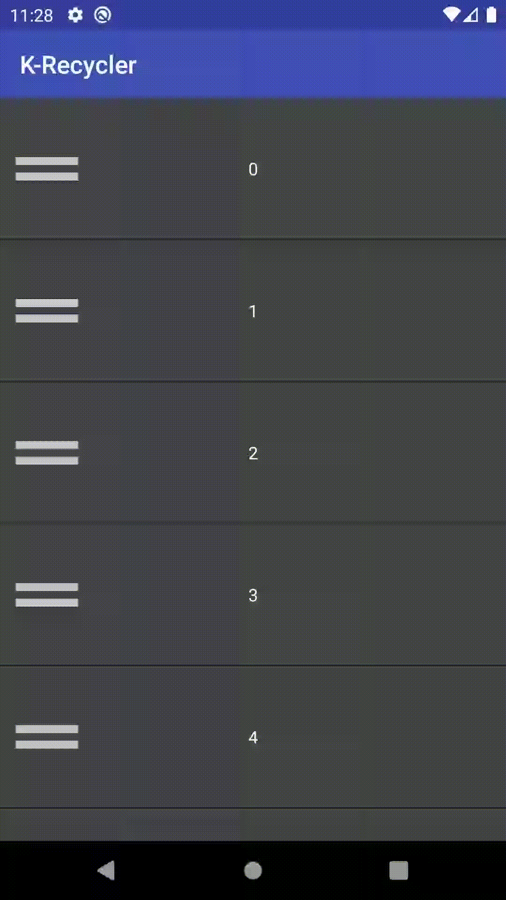

# KRecyclerView

An Android library for controlling performing drag & drop, left & right swipe on RecyclerView items.

## Contents
- **KRecycler**: The library responsible for handling the various actions.
- **KRecyclerSample**: A basic sample to highlight usage of the library.

## Demo

## Credits
Some gui controls are adopted from Paul Burke ([iPaulPro](https://github.com/iPaulPro)).